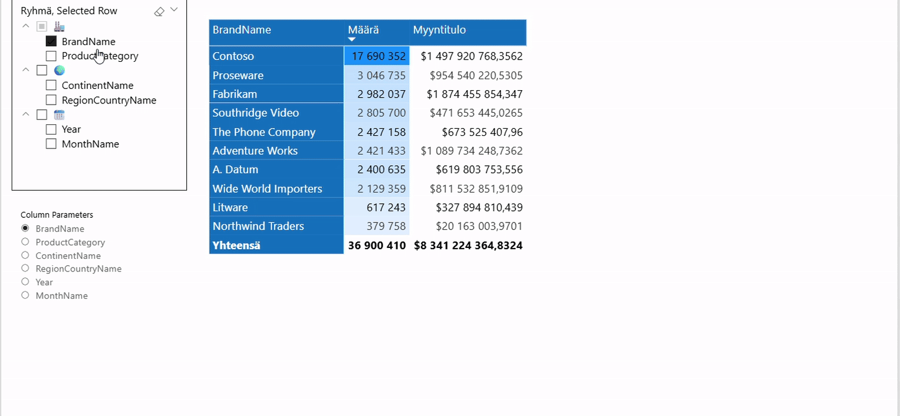
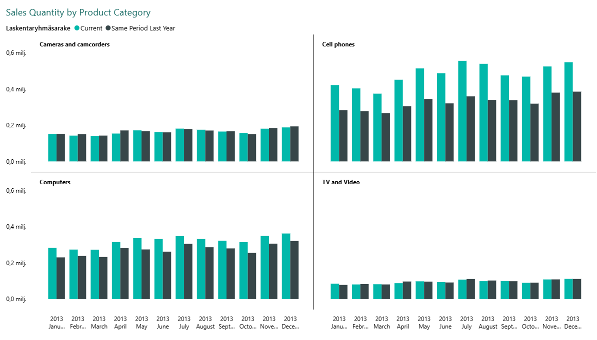
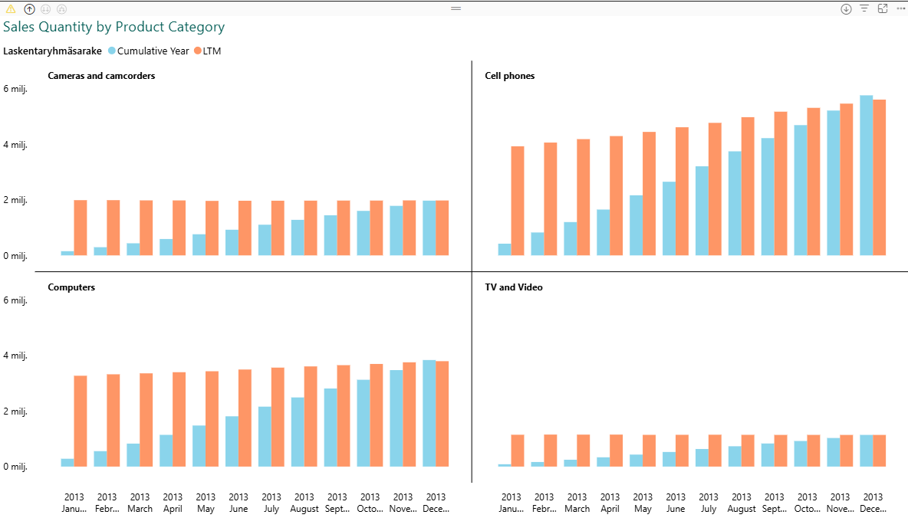

# Power BI Tricks
## Sisällysluettelo
- [Dynaaminen Power BI matriisin rivien ja sarakkeiden suodatus](#dynaaminen-power-bi-matriisin-rivien-ja-sarakkeiden-suodatus)
- [User Defined Functions - Käyttäjän määrittelemät funktiot](#user-defined-functions---käyttäjän-määrittelemät-funktiot)
  - [Toinen esimerkki UDF:n käytöstä](#Toinen-esimerkki-udfn-käytöstä)
  - [Käyttäjän valinta UDF-parametrina](#käyttäjän-valinta-udf-parametrina)
- [Calculation Groups - Laskentaryhmät ](#calculation-groups---laskentaryhmät)
- [Uutta Power BI:ssä (tammikuu 2026) - Porautuminen suoraan työkaluvihjeestä](#uutta-power-bissa-tammikuu-2026---porautuminen-suoraan-tyokaluvihjeesta)
 
--- 
### Dynaaminen Power BI matriisin rivien ja sarakkeiden suodatus
Lopputulos Power BI matriisin rivien ja sarakkeiden dynaamisesta suodatuksesta.

Esimerkissä oleva data on Microsoftin Contoso demodataa.
 

 

---
### User Defined Functions - Käyttäjän määrittelemät funktiot
Esimerkkinä numeron muotoilu. Perinteinen tapa vaatii muotoilumerkkijonon tai DAX-koodia jokaiseen mittariin, johon muotoilu halutaan kohdistaa. Käyttäjän määrittelemällä funktiolla toki vaatii saman toimenpiteen, mutta koodia ei tarvitse kirjoittaa toisteisesti ja ylläpito helpottuu. Mahdolliset muutokset täytyy tehdä funktiota käytettäessä vain yhteen paikkaan.

Muotoile-kohtaan asetetaan esim. seuraava DAX-koodi.

UDF:n kohdalla vastaava koodi olisi seuraava, mutta muotoile-kohtaan asetetaan ainoastaan funktion nimi.

Käytetyn UDF-funktion koodi.

M Sales Quantity -sarake tehty perinteisellä tavalla ja M Revenue UDF:n avulla - laskennan lopputulos on tietenkin identtinen.

 

#### Toinen esimerkki UDF:n käytöstä

Mittarit luotu perinteisellä tavalla.

  

Vs. ratkaisu, jossa mittarit käyttävät funktiota.

 

Laskennan lopputulokset ovat (tietenkin) identtisiä.

#### Käyttäjän valinta UDF-parametrina

Mittari voidaan tehdä myös ottamaan käyttäjän valinta, joka toimii dynaamisena parametrina funktiolle. Huom, tässä käytetään samaa funktiota, joka on esitelty edellisessä kohdassa.

Esimerkki, miten laskenta tapahtuu dynaamisesti.

---
### Calculation Groups - Laskentaryhmät

Laskentaryhmillä saadaan mukavasti rajoitettua mittarien määrää, jolloin ylläpidosta tulee helpompaa ja datapaneeli pysyy kuosissa. Alla tästä esimerkki.

Perusmittari

Laskentaryhmään tehty neljä eri aikalaskentaa.

Yksittäisen laskentakohteen koodi.

Esimerkki lopputuloksesta visualisoinnin muodossa.

---
### Uutta Power BI:ssä (tammikuu 2026) - Porautuminen suoraan työkaluvihjeestä
Huom! Lievä hitaus porautumisessa johtuu tietomallista ja siinä olevista lukuisista kaksisuuntaisista suhteista.

