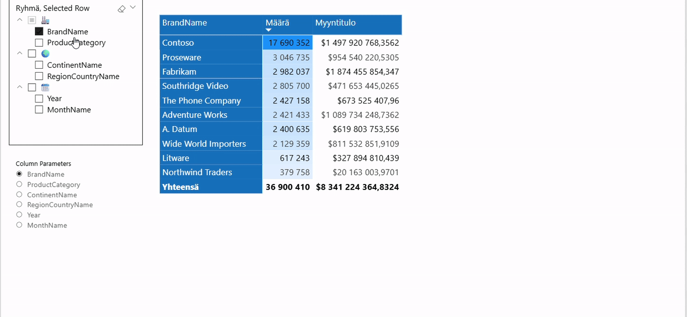
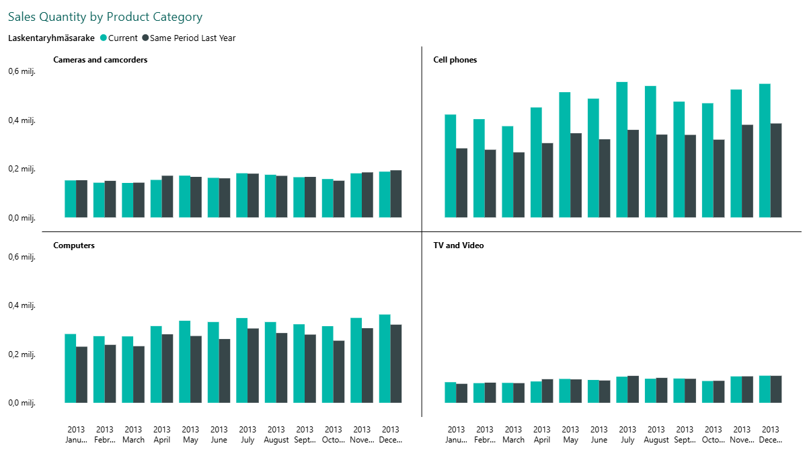
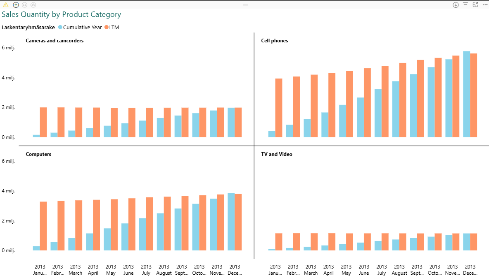
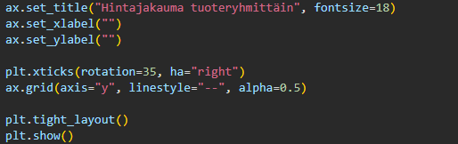
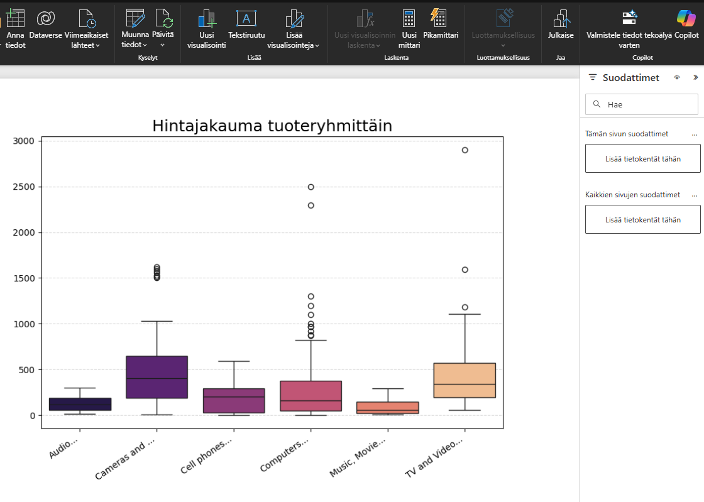
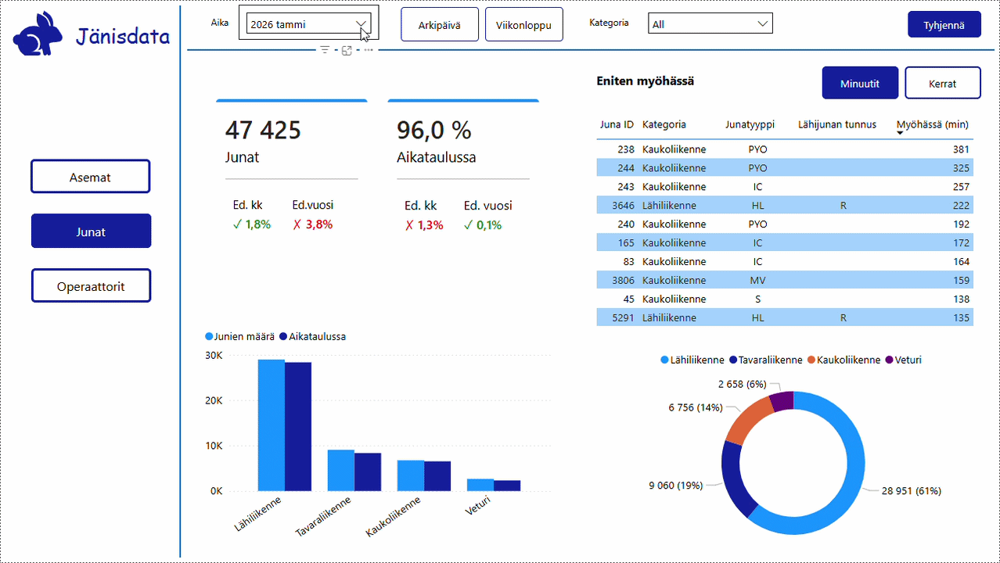

# Power BI Tricks
## Sisällysluettelo
- [Dynaaminen Power BI matriisin rivien ja sarakkeiden suodatus](#dynaaminen-power-bi-matriisin-rivien-ja-sarakkeiden-suodatus)
- [User Defined Functions - Käyttäjän määrittelemät funktiot](#user-defined-functions---käyttäjän-määrittelemät-funktiot)
  - [Toinen esimerkki UDF:n käytöstä](#toinen-esimerkki-udfn-käytöstä)
  - [Käyttäjän valinta UDF-parametrina](#käyttäjän-valinta-udf-parametrina)
- [Calculation Groups - Laskentaryhmät ](#calculation-groups---laskentaryhmät)
- [Uutta Power BI:ssä (tammikuu 2026) - Porautuminen suoraan työkaluvihjeestä](#uutta-power-bissä-tammikuu-2026---porautuminen-suoraan-työkaluvihjeestä)
- [Taulukko ja väripalkki selitteenä](#taulukko-ja-väripalkki-selitteenä)
- [Python-visualisointi](#python-visualisointi)
- [Uutta Power BI:ssä (helmikuu 2026) - Korttivisuaalin kategoriat ja suodatustoiminnallisuus](#uutta-power-bissä-helmikuu-2026---korttivisuaalin-kategoriat-ja-suodatustoiminnallisuus)
- [Power BI -raportin esimerkkisivu](#power-bi--raportin-esimerkkisivu)
- [Uutta Power BI:ssä (maaliskuu 2026)](#uutta-power-bissä-maaliskuu-2026)
  - [Viivakaavion selitteet ja johtoviivat](#viivakaavion-selitteet-ja-johtoviivat)
  - [Visualisointien moderni ulkoasu](#visualisointien-moderni-ulkoasu)
- [Power BI Modelling MCP Server](#power-bi-modelling-mcp-server)
- [Dynaaminen ranking RANKX-funktiolla](#dynaaminen-ranking-rankx-funktiolla)
 
--- 
### Dynaaminen Power BI matriisin rivien ja sarakkeiden suodatus
Lopputulos Power BI matriisin rivien ja sarakkeiden dynaamisesta suodatuksesta.

Esimerkissä oleva data on Microsoftin Contoso demodataa.
 

 

---
### User Defined Functions - Käyttäjän määrittelemät funktiot
Esimerkkinä numeron muotoilu. Perinteinen tapa vaatii muotoilumerkkijonon tai DAX-koodia jokaiseen mittariin, johon muotoilu halutaan kohdistaa. Käyttäjän määrittelemällä funktiolla toki vaatii saman toimenpiteen, mutta koodia ei tarvitse kirjoittaa toisteisesti ja ylläpito helpottuu. Mahdolliset muutokset täytyy tehdä funktiota käytettäessä vain yhteen paikkaan.

Muotoile-kohtaan asetetaan esim. seuraava DAX-koodi.

UDF:n kohdalla vastaava koodi olisi seuraava, mutta muotoile-kohtaan asetetaan ainoastaan funktion nimi.

Käytetyn UDF-funktion koodi.

M Sales Quantity -sarake tehty perinteisellä tavalla ja M Revenue UDF:n avulla - laskennan lopputulos on tietenkin identtinen.

 

#### Toinen esimerkki UDF:n käytöstä

Mittarit luotu perinteisellä tavalla.

  

Vs. ratkaisu, jossa mittarit käyttävät funktiota.

 

Laskennan lopputulokset ovat (tietenkin) identtisiä.

#### Käyttäjän valinta UDF-parametrina

Mittari voidaan tehdä myös ottamaan käyttäjän valinta, joka toimii dynaamisena parametrina funktiolle. Huom, tässä käytetään samaa funktiota, joka on esitelty edellisessä kohdassa.

Esimerkki, miten laskenta tapahtuu dynaamisesti.

---
### Calculation Groups - Laskentaryhmät

Laskentaryhmillä saadaan mukavasti rajoitettua mittarien määrää, jolloin ylläpidosta tulee helpompaa ja datapaneeli pysyy kuosissa. Alla tästä esimerkki.

Perusmittari

Laskentaryhmään tehty neljä eri aikalaskentaa.

Yksittäisen laskentakohteen koodi.

Esimerkki lopputuloksesta visualisoinnin muodossa.

---
### Uutta Power BI:ssä (tammikuu 2026) - Porautuminen suoraan työkaluvihjeestä
Huom! Lievä hitaus porautumisessa johtuu todennäköisesti mallitiedoston tietomallista ja siinä olevista lukuisista kaksisuuntaisista suhteista.

Uuden toiminnallisuuden myötä raportin käyttäjä pääsee porautumaan hieman helpommin tarkemmalle tasolle tietoon.

---
### Taulukko ja väripalkki selitteenä
Kumpi on selkeämpi? Toiseen lisätty väripalkki selitteeksi ilmaisemaan värisävyn merkitystä.

---
### Python-visualisointi
Pythonilla voi luoda visualisointeja Power BI -raporteille. Alla esimerkki laatikko- ja janakaaviosta (Boxplot). Ensin pätkä koodista ja sitten itse visualisointi.

---
###  Uutta Power BI:ssä (helmikuu 2026) - Korttivisuaalin kategoriat ja suodatustoiminnallisuus
Kategoriat toimivat korttivisuaaleissa suodattimina:

---
### Power BI -raportin esimerkkisivu
Raportissa on toistaiseksi hiukan hitautta. Taustalla on dataa > 50 M riviä. Korjaus rakentamalla mitaliarkkitehtuuriin kultatasolle aggregointitaulu.

---

### Uutta Power BI:ssä (maaliskuu 2026)
#### Viivakaavion selitteet ja johtoviivat
Kun selitteet asetetaan viivojen jatkeeksi, kaavio pysyy selkeänä myös tiheällä viivamäärällä. Johtoviivat taas yhdistävät itse viivan sarjan nimeen.

#### Visualisointien moderni ulkoasu
Tässä uusi esiversioasetus on laitettu asetuksista päälle ja otettu käyttöön kuvan raporttisivussa.

Ennen:

Jälkeen:

---

### Power BI Modelling MCP Server
Testasin tätä. Mittareiden kuvausten asettaminen yhdellä kerralla onnistui hienosti, kuten esim. taulujen ja niiden välisten suhteiden listaus. 
Mihin tämä soveltuu? Microsoftin dokumentaation mukaan avainominaisuudet ovat:
-   Natural language model editing - Create, update, and manage tables, columns, measures, and relationships across Power BI Desktop and Fabric semantic models using conversational commands
- Bulk operations at scale - Execute batch operations on hundreds of objects simultaneously with transaction support and error handling
- Best practice application - Evaluate and implement modeling best practices easily
- Agentic development workflows - Work with TMDL and Power BI Project files, enabling AI agents to autonomously plan and execute complex modeling tasks
- DAX query validation - Execute and validate DAX queries to test measures, troubleshoot calculations, and explore data

---

### Dynaaminen ranking RANKX-funktiolla

